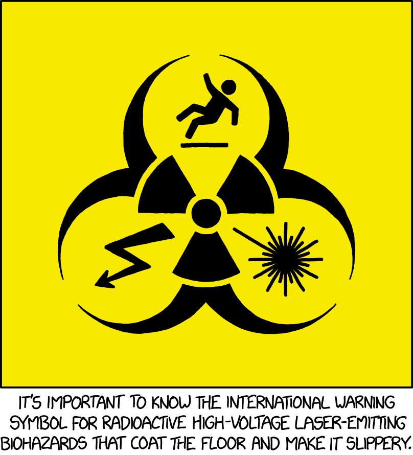

# Information Safety Guidance

## Public information can be dangerous

This site exists to provide guidelines for the public discussion of potentially dangerous subjects. We believe a thoughtful approach is necessary to balance risk in the age of expotential technologies.

[Biosecurity Info Guidelines](https://informationsafety.org/biosecurity-info-guidelines)
